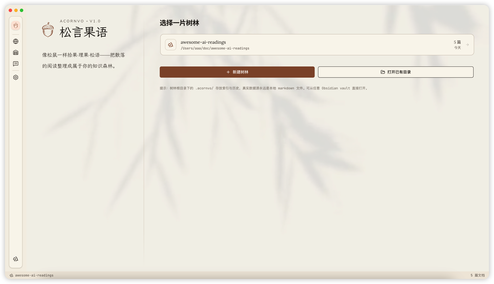
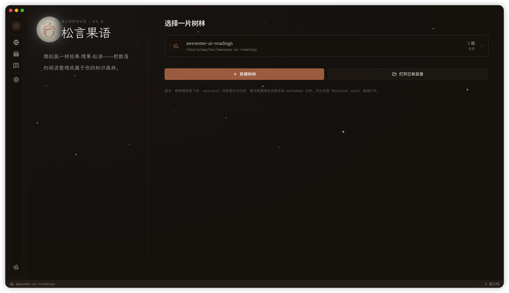
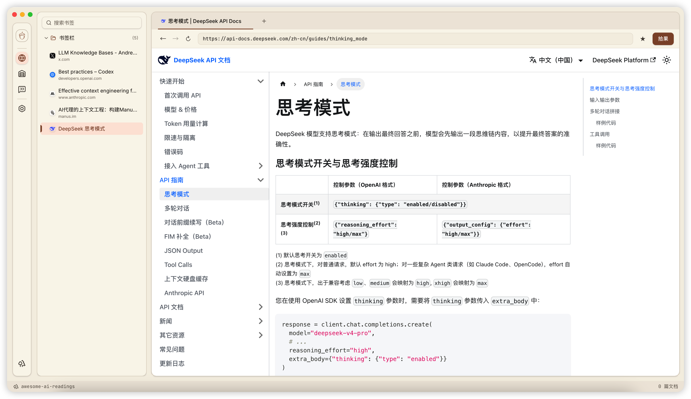
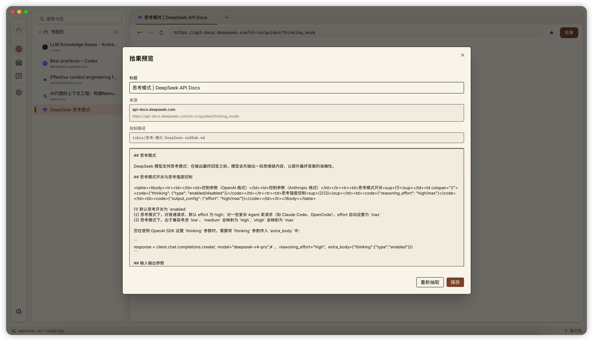
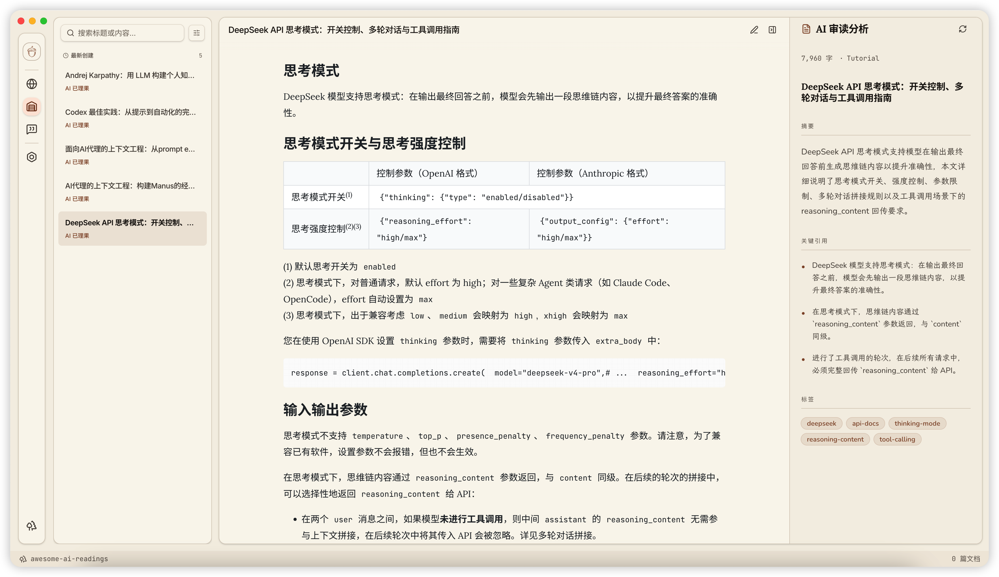
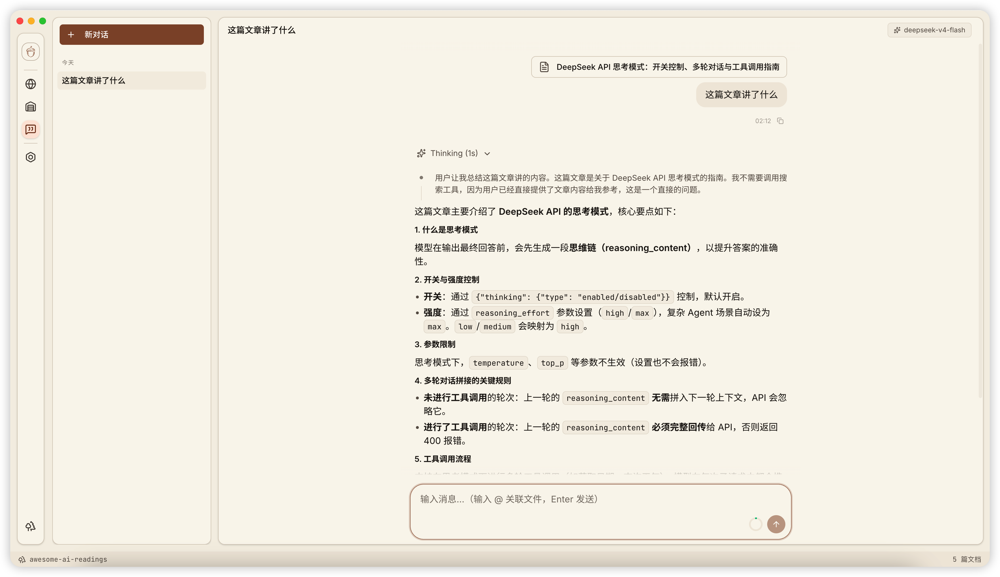
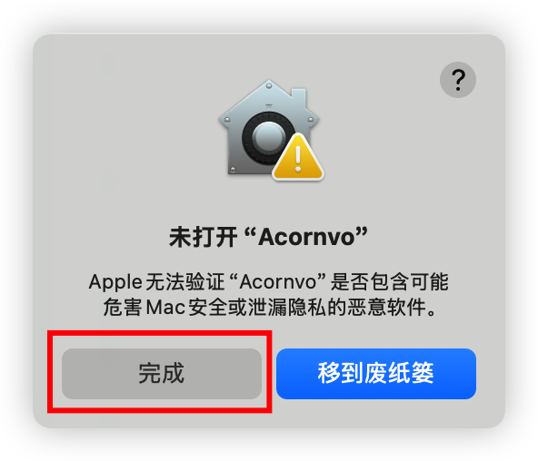
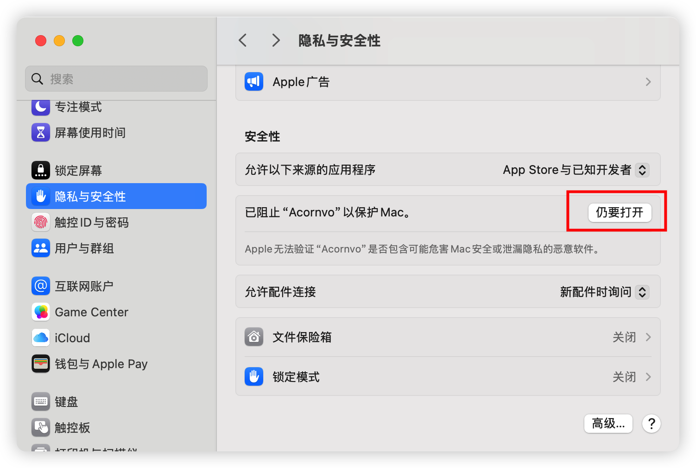
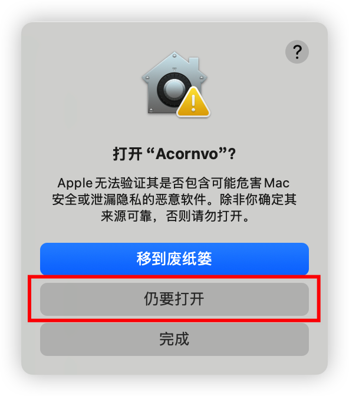
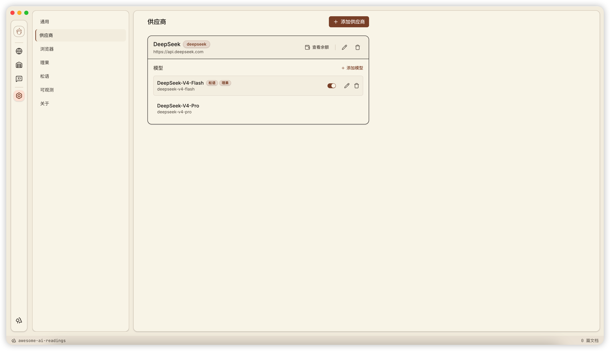

<div align="center">
  <h1>🌰 Acornvo 松言果语</h1>
  <p><b>A Local-First, AI-Native Personal Knowledge Management Desktop App</b></p>
  <p>
    <a href="https://react.dev"></a>
    <a href="https://www.electronjs.org/"></a>
    <a href="https://langchain.com/"></a>
  </p>
</div>

---




---

Acornvo (松言果语) 是一款专注于**本地优先**与 **AI 原生** 的个人知识管理（PKM）桌面应用。它致力于帮助你将散落在网页、笔记和文件夹中的碎片信息，整合为一个可长期保存、全文搜索、并能与之自由对话的 Markdown 知识库。

> [!NOTE]
> **真正的本地优先**：你的所有笔记都以纯 Markdown 文件的形式保存在本地。Acornvo 只做索引和赋能，你的数据完全兼容 Obsidian、VS Code 等主流编辑器。

## 🌟 核心理念：信息管理的三段工作流

Acornvo 的设计围绕着 **「拾果、理果、松语」** 三段核心工作流展开，覆盖了从信息收集、整理到消费的完整生命周期。

### 1. 拾果 (Clipper)：将互联网变成你的本地树林
告别繁琐的复制粘贴。Acornvo 内置了多标签页浏览器，支持一键将任何网页的正文内容深度提取并转换为纯净的 Markdown 文件，直接存入你的本地「树林」中。
- 内置浏览器，边阅读边剪藏。
- 自动提取正文，去除广告与干扰元素。




### 2. 理果 (Reviewer)：让 AI 成为你的私人档案管理员
面对堆积如山的未读文件？交给 AI 吧。Acornvo 可以自动对你的 Markdown 笔记进行深度审读。
- 自动生成：摘要、推荐标题、标签、分类、评分。
- 智能元数据：所有 AI 生成的洞察都会标准化地写入 Markdown 的 Frontmatter (YAML) 中。
- 更稳的结构化输出：根据不同模型供应商的能力自动选择合适的结构化生成策略，降低解析失败和格式漂移。
- **人在回路**：如果生成不满意，可要求 AI 重新生成。



### 3. 松语 (Chat)：与你的知识库面对面交谈
阅读只是开始。在「松语」界面，你可以直接与你的本地知识库进行对话。
- **引用本地文件**：让 AI 基于你指定的本地 Markdown 文件回答问题、梳理逻辑或进行深度写作。
- **稳定的多轮对话**：基于 `assistant-ui` 和 `LangChain` 构建，提供流式响应、消息持久化和长上下文保护，减少重复输出与消息丢失。



---

## ✨ 核心特性

- **🌲 多「树林」管理 (Workspaces)**：支持多工作区，每个「树林」都是一个独立的本地文件夹，轻松隔离不同领域的知识。
- **🤖 模型自由 (Model Agnostic)**：自带统一大模型配置。原生支持 OpenAI、Ollama（本地运行）、DeepSeek、OpenRouter 等，并针对不同供应商的结构化输出能力自动适配。
- **⚡ 混合搜索 (Hybrid Search)**：结合 SQLite FTS、`@node-rs/jieba` 中文分词、`sqlite-vec` 向量检索和本地 `bge-small-zh-v1.5` 语义模型，同时支持关键词命中与语义相似度排序。
- **📝 现代编辑器 (Vditor)**：集成 Vditor Markdown 编辑器，所见即所得，自动保存，并能优雅处理外部修改冲突。
- **🔧 可维护索引 (Rebuildable Index)**：可在设置中手动重建全文索引与向量索引，便于升级后恢复搜索质量或修复异常状态。
- **🔒 隐私与安全 (Privacy)**：不强制要求任何云同步；剪藏内容会清理危险标签与事件属性，外链打开也会做安全限制。

---

## 🛠️ 数据存储：透明且自由

Acornvo 拒绝黑盒数据库。你的数据分为**树林（工作区）数据**与**全局数据**两部分：

**1. 树林数据（知识库内）**
你的知识库目录结构清晰可见，笔记与索引均存储在当前树林中，方便随文件夹整体打包或迁移：

```text
我的知识库/
├── inbox/                 # 果篮：默认的网页剪藏目录
│   └── 2026-AI-Trends.md  # 你的知识，纯粹的 Markdown
└── .acornvo/              # 工作区级缓存与索引
    └── index.db           # SQLite 全文索引、向量索引与缓存数据
```

**2. 全局数据（系统主目录）**
应用的全局配置（如最近打开的树林记录、全局配置数据库）和运行日志，统一保存在用户主目录下的 `.acornvo` 文件夹中（macOS / Windows 均为 `~/.acornvo`）：

```text
~/.acornvo/
├── logs/                  # 应用运行日志
├── global.db              # 全局配置数据库
└── recent-projects.json   # 最近打开的项目列表
```

---

## 🚀 下载、安装与配置指南

### 1. 下载与安装

Acornvo 支持主流桌面操作系统。请前往 [Releases](https://github.com/dyx/acornvo/releases) 页面下载最新版本：

| 平台 | 安装包格式 | 说明                      |
| :--- | :--- |:------------------------|
| **macOS** | `.dmg` | 提供 Apple Silicon (arm64) |
| **Windows** | `.exe` | 一键安装包                |

> [!IMPORTANT]
> **macOS 安装安全性提示：**
> 由于应用暂未进行苹果开发者签名，首次打开安装后的应用时，系统可能会提示 **“未打开 Acornvo，Apple 无法验证是否包含恶意软件”** 或 **“文件已损坏”**。
>
> **解决方法：通过系统设置**
> 1. 正常双击打开应用，看到警告提示后点击“完成”。
>
> 
>
> 2. 打开 macOS 的 **“系统设置” -> “隐私与安全性”**，向下滚动找到“安全性”部分。你会看到提示“已阻止 Acornvo...”，点击旁边的 **“仍要打开”** 按钮即可（见下图）。
>
> 
>
> 3. 会出现一个新的弹窗，选择“仍要打开”。之后输入密码即可。
>
>    

### 2. AI 模型供应商配置

安装完成后，你需要配置大语言模型 (LLM) 才能使用「理果」和「松语」的核心功能。点击应用左下角的**设置图标**，进入**模型配置**：

- **DeepSeek**：输入你的 API Key 即可。
- **Ollama (本地模型)**：如果你希望完全离线运行，请先在本地安装 [Ollama](https://ollama.com/) 并下载模型。在 Acornvo 中选择 Ollama 服务商即可。
- **OpenRouter**：支持自定义配置兼容 OpenAI 格式的 API 接口，实现极高的模型自由度。

> [!IMPORTANT]
> **务必设置默认模型：**
> 在成功配置并保存模型提供商后，请在**模型列表**中找到你刚刚配置好的模型，并**将其设置为默认模型**。只有设置了默认模型，应用的 AI 功能（如自动理果、松语对话）才能正常运行。



---

## 💻 开发者指南

**核心技术栈：**
- **框架**: Electron, React 19, TypeScript, Vite
- **UI & 样式**: Tailwind CSS v4, shadcn/ui, Radix UI
- **AI 生态**: assistant-ui, LangChain, LangGraph
- **本地能力**: better-sqlite3, sqlite-vec, chokidar, @node-rs/jieba, @huggingface/transformers, onnxruntime-node

**本地运行：**

```bash
# 1. 安装依赖
npm install

# 2. 启动开发服务器
npm run dev
```

**打包构建：**

```bash
npm run dist:mac    # macOS 打包
npm run dist:win    # Windows 打包
```

---

## 📅 路线图 (Roadmap)

Acornvo 正处于快速迭代期，接下来的重点方向包括：
- [ ] [LLM Wiki](https://gist.github.com/karpathy/442a6bf555914893e9891c11519de94f)：AI 驱动的自动知识库构建
- [ ] 更智能、更精准的网页正文解析引擎
- [ ] 完善的 AI 自动标签系统与自动分类
- [ ] 多轮对话深度生成能力扩展

## 🫶 感谢

- 首页的 Sunny / Moonlight 主题动效代码参考自 [dingyi](https://x.com/dingyi) 的 [Theme Switch](https://theme-switch.pages.dev/) 网站，特此感谢！

## 📄 许可证 (License)

MIT
